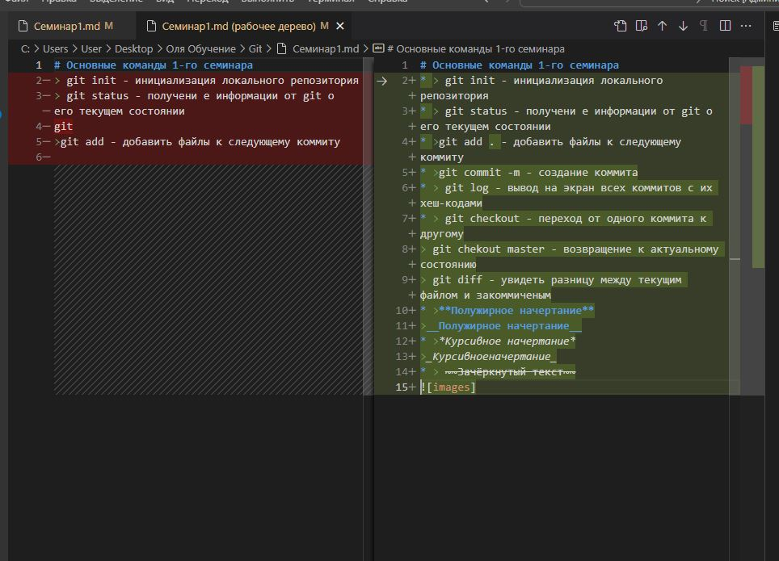

# Основные команды 1-го семинара

* > git init - инициализация локального репозитория

* > git status - получени е информации от git о его текущем состоянии

* >git add . - добавить файлы к следующему коммиту

* >git commit -m - создание коммита

* >git commit -am - добовление файлов в отслеживание и создание коммитов

* > git log - вывод на экран всех коммитов с их хеш-кодами

## Команды git checkout
> git checkout - переход от одного коммита к другому

> git chekout master - возвращение к актуальному состоянию

> git diff - увидеть разницу между текущим файлом и закоммиченым
## Оформление текста
* >**Полужирное начертание**

>__Полужирное начертание__

* >*Курсивное начертание*

>_Курсивноеначертание_

* > ~~Зачёркнутый текст~~

# Список команд 2-го семинара

## Работа с ветками
* > git branch - показать список веток

* > git branch <branch_name> - создание ветки с названием branch_name

* > git checkout name_branch - переход на ветку

* > git  branch -d name_branch - удаление ветки

* > git checkout -b name_branch - создание ветки и переход на неё

* > git merge --abort - отмена слияния при  конфликте

